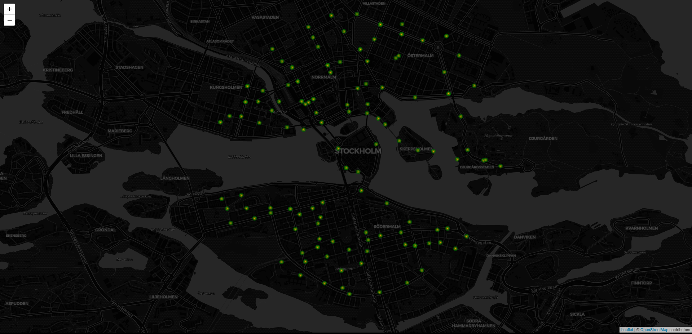

# react-public-transport-map

## Description:
Shows distance to area bus- and trainstations, in Sweden.

## Development:
docker*-files in root are settings for the docker development container.
Folder .devcontainer is for vscode, to startup the above development container.

## App usage:
- Click on the position where stations are to be shown.
- Click on a station icon to show station details.

## API´s:
- https://leafletjs.com/
- http://www.trafiklab.se/api/sl-narliggande-hallplatser

